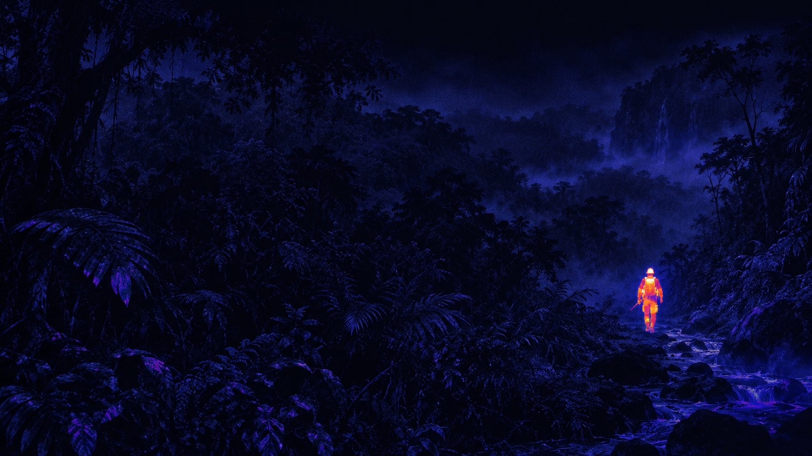

# Yautja theme for Omarchy

A thermal-vision theme for [Omarchy](https://omarchy.org). Cold indigo
surfaces, a white-hot to magenta gradient on the focused window, cold blue on
the rest, and a btop palette where every meter reads as heat.



Fan-made and unaffiliated with any film or game franchise.

## Install

```bash
omarchy theme install https://github.com/neilofneils404/omarchy-yautja-theme
```

For vision-mode shaders, the window cloak, the hunt key, the trophy wall and
the heat glow around the focused window, add the companion plugin:
[omarchy-yautja](https://github.com/neilofneils404/omarchy-yautja).

## Backgrounds

`backgrounds/` holds the 16:9 set (3840x2160) that Omarchy cycles through.
Each one is also composed for other screens:

| Folder | Aspect | Size |
| --- | --- | --- |
| `backgrounds/` | 16:9 | 3840x2160 |
| `backgrounds-ultrawide/` | 21:9 | 3440x1440 |
| `backgrounds-16x10/` | 16:10 | 2560x1600 |

To use another set, copy it over the default one after installing:

```bash
cd ~/.config/omarchy/themes/yautja
cp backgrounds-ultrawide/* backgrounds/
omarchy theme set yautja
```

The prompts behind every image are in `prompts/`.

## Palette

| Role | Colour |
| --- | --- |
| Background | `#060818` |
| Foreground | `#F4EAD2` |
| Accent | `#FF9A1F` |
| Cold | `#1A2470` `#3F6BFF` `#22C7E8` |
| Hot | `#C63DF2` `#FF3B2F` `#FF8A1F` `#FFD91A` |

## Licence

MIT
